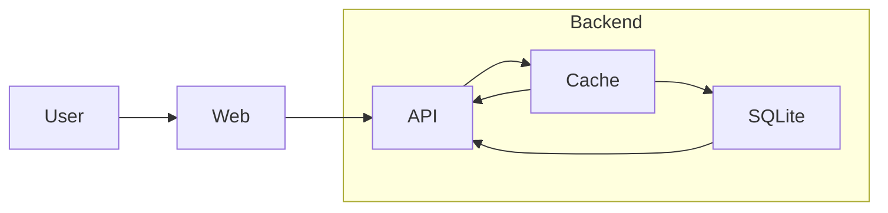
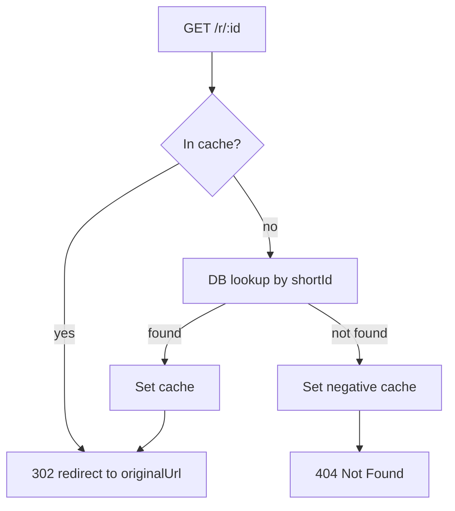

# URL Shortener (HTML Email Parser)

Full-stack TypeScript app that shortens URLs in uploaded HTML email files. It parses links in the HTML, stores originals in a database, generates short redirect URLs, and returns the modified HTML for download or preview.

Demo can be found [here](https://url-shortener-service-mu.vercel.app/). 

## Highlights
- Frontend: React + TypeScript (Vite), TailwindCSS
- Backend: Express + TypeScript, Prisma ORM (SQLite by default)
- Parsing: Cheerio
- Short IDs: nanoid (with retry on unique constraint to prevent collisions)
- Redirect cache: in-memory LRU + TTL for hot URLs
- Endpoints:
	- POST `/shorten` — upload an HTML file, returns modified HTML
	- GET `/r/:id` — redirect to the original URL

## Project Layout
- `web/`: Vite React UI
- `server/`: Express API + Prisma + SQLite
- `examples/`: example HTML for testing

## Architecture Diagram



## Data Model (Prisma)

```
model Url {
	id           String   @id @default(cuid())
	shortId      String   @unique
	originalUrl  String   @unique
	createdAt    DateTime @default(now())
}
```

Notes:
- `originalUrl` is unique to guarantee the same `shortId` is reused when the same URL appears again.
- The server includes retry-on-collision logic for `shortId` to guard against the extremely rare chance of nanoid collisions.

## Local Development

Requirements:
- Node.js 18+
- npm 8+

1) Install dependencies

```bash
# backend
cd server
npm install

# generate prisma client and create DB schema
npx prisma db push
npx prisma generate

# frontend
cd ../web
npm install
```

2) Configure env

- Backend (`server/.env`)
```
DATABASE_URL="file:./dev.db"
PORT=4000
BASE_URL=http://localhost:4000

# Redirect cache (optional; defaults shown)
REDIRECT_CACHE_MAX=1000
REDIRECT_CACHE_TTL_MS=300000          # 5 minutes
REDIRECT_CACHE_NEG_TTL_MS=30000       # 30 seconds for 404s
```

- Frontend (`web/.env`)
```
VITE_API_BASE_URL=http://localhost:4000
```

3) Run

```bash
# terminal 1: backend
cd server
npm run dev

# terminal 2: frontend
cd web
npm run dev
```

Open the frontend at the printed Vite URL (default http://localhost:5173).

## Usage
- Upload an `.html` email file (max 2MB).
- Click "Process HTML". The app posts to `/shorten` and gets modified HTML back.
- Click "Download" to save the processed HTML.
- Optional: Preview the HTML in the iframe.

Only `http` and `https` links are shortened. `mailto:`, `tel:`, `javascript:`, etc. are ignored.

### Redirect cache-first flow



## Quick deploy (prototype)
#### Backend (Render)
- New Web Service → connect this repo
- Root directory: `server`
- Build command:
  - `npm install && npx prisma db push && npx prisma generate && npm run build`
- Start command:
  - `npm start`
- Environment variables:
  - `DATABASE_URL=file:/var/data/dev.db` (requires a disk)
  - `BASE_URL=https://url-shortener-service-abup.onrender.com`
- Persistent disk:
  - Add a disk (e.g., 1–5 GB) mounted at `/var/data`
- Health check:
  - Path `/health` should return `{ ok: true }`

#### Frontend (Vercel)
- New Project → import this repo
- Root directory: `web`
- Build command: `npm install && npm run build`
- Output directory: `dist`
- Environment variables:
  - `VITE_API_BASE_URL=https://url-shortener-service-abup.onrender.com`

#### Smoke test
- `GET https://url-shortener-service-abup.onrender.com/health` → `{ ok: true }`
- In the UI, upload an HTML file with https links and click Process → response should contain `/r/:id` links
- Open a generated `https://url-shortener-service-abup.onrender.com/r/SHORTID` → 302 to the original URL (can also review logs to confirm 302s)


## Scaling Overview: 100k vs 100m Requests/Day
Assumptions: Most traffic hits `GET /r/:id` (redirect). `POST /shorten` is heavier but infrequent.

- ~100k/day (≈1.2 RPS avg; occasional bursts)
	- OK on a single small instance.
	- In-memory redirect cache is sufficient.
	- SQLite works; consider Postgres if you expect spikes or multiple instances.
	- Add simple rate limiting to `/shorten`.

- ~100m/day (≈1,160 RPS avg; bursty)
	- Introduce Redis read-through cache for redirects (shortId → originalUrl) with negative caching for 404s.
	- Move DB to managed Postgres + pgBouncer; keep `shortId` and `originalUrl` unique (already in schema).
	- Horizontal scale stateless API instances behind a load balancer.
	- Optional: return 301 and set Cache-Control to enable CDN caching of the redirect (only if mappings never change).
	- Make analytics async (queue/stream) or use Redis counters; don’t write per-click synchronously.
	- Observability: track p95/p99 latency, cache hit rate, DB latency; use HPA or autoscaling.

### TLDR: Future implementations to handle 100m requests/day
- Replace in-memory cache with Redis cache in front of DB for redirect lookups (read-through + negative caching).
- Postgres + pgBouncer. Keep ORM/queries lean on miss path.
- Multiple API instances + autoscale.
- Async analytics pipeline.
- Optional CDN caching for 301 redirects.
- Implement rate limiting and basic auth.


## Metrics and Analytics
For production use, storing a small set of additional metrics can help with monitoring, debugging, and reporting. Here are potentially useful fields and patterns:

- urlObservationCount (Int) — increment on each observation of an originalUrl; use `prisma.url.update({ data: { urlObservationCount: { increment: 1 } } })`.
- clickCount (Int) — increment on each redirect; use `prisma.url.update({ data: { clickCount: { increment: 1 } } })`.
- lastAccessed (DateTime) — set on redirect to know when it was last used.
- disabled (Boolean) — allow deactivation without deleting.

## Long-Term Strategies
- Authentication & authorization
	- Support JWT/OAuth2 or API keys; tie shortened URLs to users/organizations (for multi-tenant/scalability).
	- Per-user/org rate limits and quotas; throttling on `/shorten`.

- CI/CD
	- GitHub Actions: install, typecheck, lint, test, build, prisma generate.
	- Production deploy: `prisma migrate deploy` (when you move to migrations) and smoke tests.
	- Preview environments for pull requests; cache dependencies; required checks before merge.

- Infrastructure & environments
	- Separate dev/staging/prod; Infrastructure as Code (e.g., Terraform) for reproducibility.
	- Secrets manager (Render env, Doppler, 1Password, AWS Secrets Manager); periodic rotation.
	- Feature flags for risky changes; blue/green or canary deployments for safer rollouts.

- Observability
	- Metrics: request rate, p95/p99 latency, error rate, cache hit ratio, DB/query latency.
	- Tracing across cache → DB path; structured logs with request IDs.

- Security
	- Input validation; strict CORS for production; rate limiting and basic auth if public.
	- Least-privilege DB credentials; no secrets in logs; regular dependency updates.

- Performance & caching
	- Redis read-through cache for redirects (shared across instances); negative caching for 404s.
	- Optional CDN caching with 301 if mappings are immutable; tune TTLs by use case.
	- Connection pooling (pgBouncer), HPA/autoscaling, and cost monitoring.

- Testing
	- Unit tests (URL parsing), integration tests (routes), e2e flows (shorten → redirect).
	- Load tests for GET `/r/:id`; contract tests between web and API; seed fixtures.

- Reliability
	- Circuit breakers/timeouts around DB/cache; retry with backoff for transient failures.

## Dependencies (server)
- morgan — HTTP request logger middleware (logs each request like `POST /shorten 200 15ms`).
- multer — Multipart/form-data parser for file uploads; used to accept `.html` files at `/shorten`.
- nanoid — Generates short, URL-safe IDs for redirects; we retry on unique conflicts to avoid collisions.
- @prisma/client — Type-safe ORM for DB access (find/create URL rows, etc.).
- cheerio — Server-side HTML parser/manipulator (selects tags and rewrites URLs).